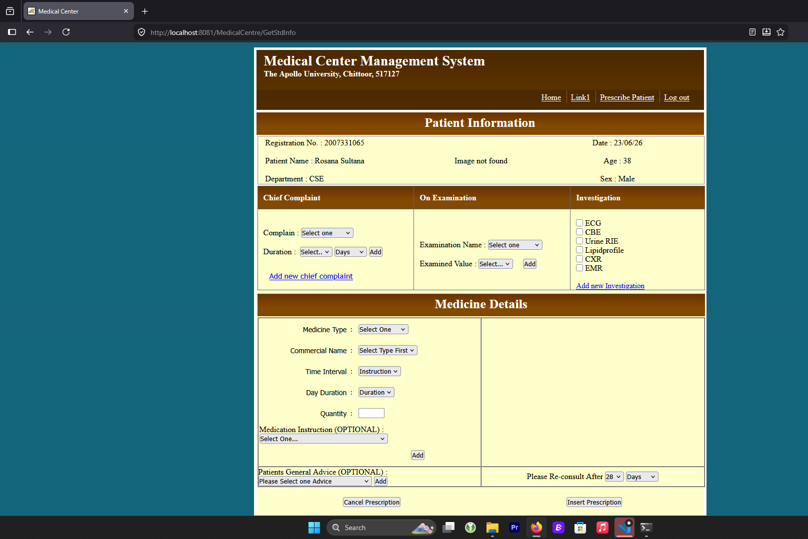
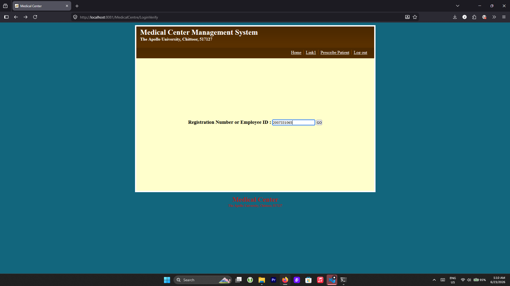
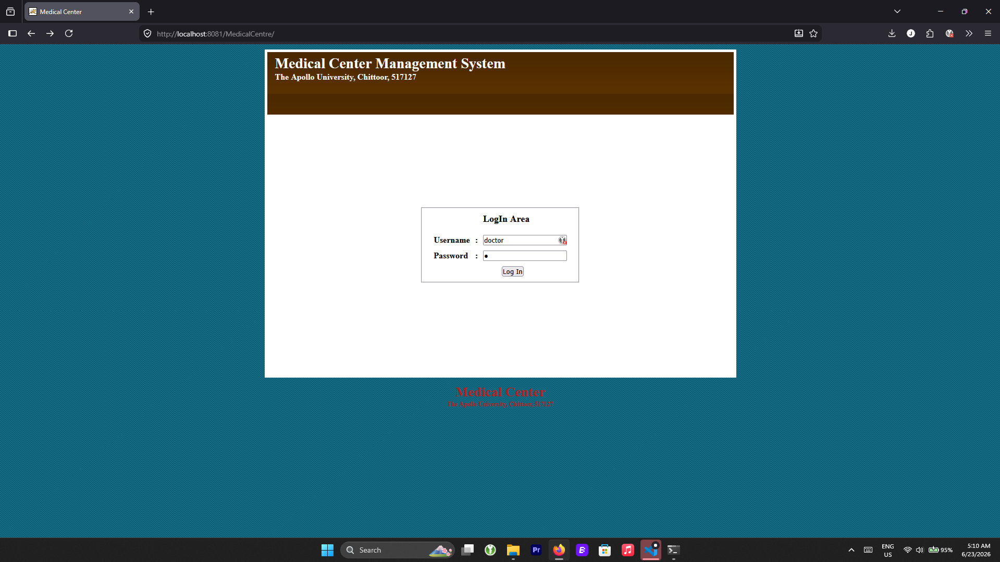

# Medical Center Management System

A comprehensive JSP/Servlet-based web application for managing medical center operations, including doctor prescriptions, medicine inventory, stock transfers, and student medical records.

## Table of Contents
- [Features](#features)
- [Screenshots](#screenshots)
- [Prerequisites](#prerequisites)
- [Database Setup](#database-setup)
- [Project Structure](#project-structure)
- [Building the Application](#building-the-application)
- [Deployment to Tomcat](#deployment-to-tomcat)
- [Running the Application](#running-the-application)
- [Default User Credentials](#default-user-credentials)
- [Configuration](#configuration)
- [Troubleshooting](#troubleshooting)

## Features

- **Doctor Management**: Prescription creation and tracking for students
- **Medicine Inventory**: Stock management and medicine distribution
- **Stock Ledger**: Track medicine movement and transfers between departments
- **Student Records**: Maintain student health profiles and prescription history
- **User Roles**: Support for multiple user roles (Doctor, Pharmacist, Medicine Distributor, Employee, Student)
- **Secure Authentication**: User login verification
- **Image Management**: Store and retrieve medical images and documents

## Screenshots

### Login Page


### Dashboard


### Prescription Page


## Prerequisites

### System Requirements
- **Java Development Kit (JDK)**: Java 8 or higher
  - Download from: https://adoptopenjdk.net/ or use OpenJDK 8
- **Apache Tomcat**: Version 9.0.x
  - Download from: https://tomcat.apache.org/download-90.cgi
- **MySQL Server**: Version 5.7 or higher
  - Download from: https://www.mysql.com/downloads/mysql/
- **MySQL Connector/J**: Version 9.6.0 or compatible
- **Apache Ant**: For building (optional, PowerShell scripts provided for Windows)

### Software Verification
```powershell
# Verify Java installation
java -version

# Verify MySQL installation (if using command line)
mysql --version
```

## Database Setup

### Step 1: Create Database
```sql
-- Connect to MySQL
mysql -u root -p

-- Create database
CREATE DATABASE central_db;
USE central_db;
```

### Step 2: Import Database Schema
```powershell
# Navigate to project root
cd path\to\medical-center-master

# Import the database schema
mysql -u root -p central_db < database\central_db.sql
```

### Step 3: Verify Database Connection
```sql
-- Connect to the database
mysql -u root -p central_db

-- Show tables to verify import
SHOW TABLES;

-- Check users table
SELECT COUNT(*) FROM users;
```

### Database Credentials (Default)
- **Username**: root
- **Password**: 9177559442@Jai
- **Database**: central_db
- **Host**: localhost
- **Port**: 3306

**Note**: Update credentials in `MedicalCentre/java/medicalcenter/database.java` if using different credentials.

## Project Structure

```
medical-center-master/
├── MedicalCentre/
│   ├── java/
│   │   ├── medicalcenter/         # Core Java classes
│   │   │   ├── ClientDate.java
│   │   │   ├── database.java      # Database configuration
│   │   │   └── StockLedgerEntry.java
│   │   └── servlet/               # Servlet controllers
│   │       ├── LoginVerify.java
│   │       ├── GetStdInfo.java
│   │       ├── AddNewMed.java
│   │       └── [other servlets]
│   └── web/                       # Web resources
│       ├── index.jsp              # Home page
│       ├── login.jsp              # Login page
│       ├── include/               # Shared JSP includes
│       │   ├── header.jsp
│       │   ├── footer.jsp
│       │   └── menus/
│       ├── CSS/                   # Stylesheets
│       ├── javascript/            # Client-side scripts
│       └── WEB-INF/
│           ├── web.xml            # Deployment descriptor
│           ├── lib/               # JAR dependencies
│           └── classes/           # Compiled Java classes
├── database/
│   ├── central_db.sql             # Database schema
│   └── DBQuery.txt
├── scripts/
│   ├── build.ps1                  # PowerShell build script
│   └── deploy.ps1                 # PowerShell deploy script
├── tools/
│   └── apache-tomcat-9.0.118/     # Tomcat server
└── README_SETUP.md                # This file
```

## Building the Application

### Option 1: Using PowerShell Script (Windows)

```powershell
# Navigate to project root
cd path\to\medical-center-master

# Run build script
.\scripts\build.ps1
```

This script will:
1. Compile all Java source files
2. Place compiled classes in `MedicalCentre/web/WEB-INF/classes`

### Option 2: Manual Build

```powershell
# Navigate to project root
cd path\to\medical-center-master

# Compile Java files
javac -d MedicalCentre\web\WEB-INF\classes `
  -cp "mysql-connector-j-9.6.0/*;MedicalCentre/web/WEB-INF/lib/*" `
  MedicalCentre\java\medicalcenter\*.java

javac -d MedicalCentre\web\WEB-INF\classes `
  -cp "mysql-connector-j-9.6.0/*;MedicalCentre/web/WEB-INF/lib/*" `
  MedicalCentre\java\servlet\*.java
```

## Deployment to Tomcat

### Step 1: Verify Tomcat Installation
```powershell
# Check if Tomcat is in the tools directory
ls tools\apache-tomcat-9.0.118\bin\
```

### Step 2: Deploy Application

**Option 1: Using PowerShell Script**
```powershell
cd path\to\medical-center-master
.\scripts\deploy.ps1
```

**Option 2: Manual Deployment**
```powershell
# Copy the entire web application to Tomcat
Copy-Item -Path "MedicalCentre\web\*" `
  -Destination "tools\apache-tomcat-9.0.118\webapps\MedicalCentre\" `
  -Recurse -Force
```

### Step 3: Set MySQL Connector
```powershell
# Ensure MySQL connector is in Tomcat lib directory
Copy-Item -Path "mysql-connector-j-9.6.0\mysql-connector-j-9.6.0.jar" `
  -Destination "tools\apache-tomcat-9.0.118\lib\" -Force
```

## Running the Application

### Step 1: Start Tomcat

```powershell
# Navigate to Tomcat bin directory
cd tools\apache-tomcat-9.0.118\bin\

# Start Tomcat
.\startup.bat

# Wait for startup (approximately 5-10 seconds)
# You should see "Server startup" message
```

### Step 2: Access the Application

Open your web browser and navigate to:
```
http://localhost:8081/MedicalCentre/
```

You should see the Medical Center Management System homepage.

### Step 3: Stop Tomcat

```powershell
# From Tomcat bin directory
.\shutdown.bat

# Wait for graceful shutdown (5-10 seconds)
```

## Default User Credentials

### Doctor Account
- **Username**: doctor
- **Password**: d
- **Role**: Doctor
- **Employee ID**: 26

### Pharmacist Account
- **Username**: pharmacist
- **Password**: p
- **Role**: Pharmacist

### Medicine Distributor Account
- **Username**: distributor
- **Password**: dist
- **Role**: Medicine Distributor

### Employee Account
- **Username**: employee
- **Password**: emp
- **Role**: Employee

### Student Account
- **Username**: student
- **Password**: std
- **Role**: Student

**Note**: These are default test credentials. Change them in production.

## Configuration

### Database Connection Settings

Edit `MedicalCentre/java/medicalcenter/database.java`:

```java
// Database configuration
public static final String DB_URL = "jdbc:mysql://localhost:3306/central_db";
public static final String DB_USER = "root";
public static final String DB_PASSWORD = "9177559442@Jai";
public static final String DB_DRIVER = "com.mysql.cj.jdbc.Driver";
```

### Tomcat Port Configuration

Default port: **8081**

To change the port, edit `tools/apache-tomcat-9.0.118/conf/server.xml`:

```xml
<Connector port="8081" protocol="HTTP/1.1"
           connectionTimeout="20000"
           redirectPort="8443" />
```

Replace `8081` with your desired port.

### Context Path Configuration

The application is deployed at `/MedicalCentre` context path.

To change it, rename the deployment directory in Tomcat:
```powershell
# Rename from MedicalCentre to desired name
Rename-Item "tools\apache-tomcat-9.0.118\webapps\MedicalCentre" -NewName "YourAppName"
```

Then access at: `http://localhost:8081/YourAppName/`

## Troubleshooting

### Issue: "Cannot find database"
**Solution**: Verify MySQL is running and database is created:
```powershell
# Connect to MySQL
mysql -u root -p central_db -e "SHOW TABLES;"
```

### Issue: "Port 8081 already in use"
**Solution**: Change Tomcat port or stop the application using that port:
```powershell
# Find process using port 8081
netstat -ano | findstr :8081

# Kill the process (replace PID with actual process ID)
taskkill /PID <PID> /F
```

### Issue: "ClassNotFoundException: com.mysql.cj.jdbc.Driver"
**Solution**: Verify MySQL connector is in Tomcat lib:
```powershell
ls tools\apache-tomcat-9.0.118\lib\mysql-connector*
```

If not present, copy it:
```powershell
Copy-Item "mysql-connector-j-9.6.0\mysql-connector-j-9.6.0.jar" `
  -Destination "tools\apache-tomcat-9.0.118\lib\" -Force
```

### Issue: JSP pages not updating after changes
**Solution**: Clear Tomcat work directory and restart:
```powershell
# Stop Tomcat first
cd tools\apache-tomcat-9.0.118\bin\
.\shutdown.bat

# Delete work directory
Remove-Item -Path "..\work\*" -Recurse -Force

# Restart Tomcat
.\startup.bat
```

### Issue: "Connection refused" when accessing application
**Solution**: Verify Tomcat is running:
```powershell
# Check Tomcat logs for errors
cat tools\apache-tomcat-9.0.118\logs\catalina.out

# Restart Tomcat
cd tools\apache-tomcat-9.0.118\bin\
.\startup.bat
```

## Development Workflow

### Making Changes
1. Edit Java files in `MedicalCentre/java/`
2. Edit JSP files in `MedicalCentre/web/`
3. Run build script: `.\scripts\build.ps1`
4. Deploy updated files: `.\scripts\deploy.ps1`
5. Restart Tomcat

### Testing
1. Access the application: `http://localhost:8081/MedicalCentre/`
2. Log in with test credentials
3. Test functionality
4. Check browser console for errors (F12)
5. Check Tomcat logs: `tools/apache-tomcat-9.0.118/logs/`

## Features Usage Guide

### Doctor - Create Prescription
1. Log in as doctor
2. Search for student by registration number
3. Create new prescription
4. View prescription in printable format

### Pharmacist - Manage Stock
1. Log in as pharmacist
2. Add new medicines to inventory
3. Track stock levels
4. View medicine distribution history

### Medicine Distributor - Distribute Medicines
1. Log in as distributor
2. View available medicines
3. Create distribution records
4. Confirm delivery to students

## Support & Documentation

For additional help:
- Check Tomcat documentation: https://tomcat.apache.org/tomcat-9.0-doc/
- MySQL documentation: https://dev.mysql.com/doc/
- Java documentation: https://docs.oracle.com/javase/8/docs/

## License

This project is part of an internship program.

## Contact & Contributions

For issues, improvements, or contributions, please:
1. Document the issue clearly
2. Include steps to reproduce
3. Provide error logs if applicable
4. Submit via GitHub Issues

---

**Last Updated**: June 2026  
**Project Status**: Active Development
